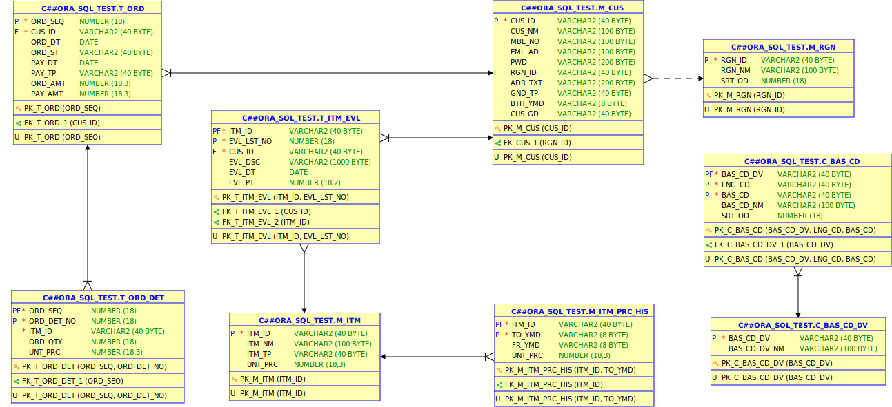
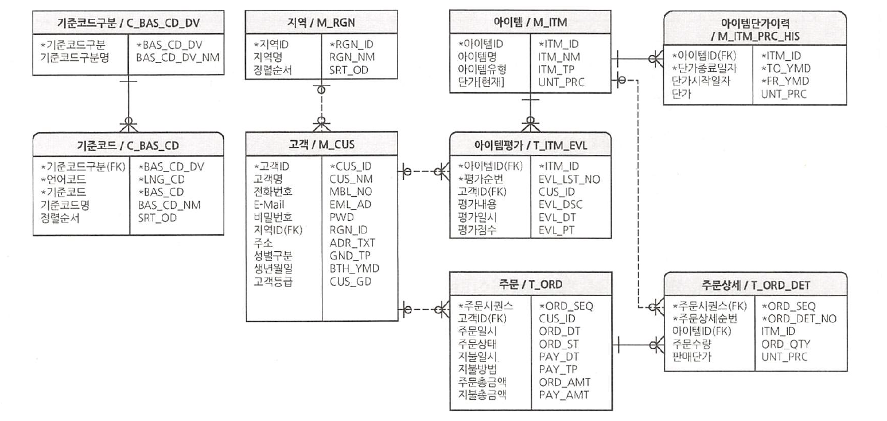

# sql-practice


## Install Oracle on Windows
Version : 19 XE


## SET TABLE STORAGE
```sql
CREATE TABLESPACE ORA_SQL_TEST_TS DATAFILE 'C:\dev\ORA_SQL_TEST\ORA_SQL_TEST.DBA' SIZE 10G
EXTENT MANAGEMENT LOCAL SEGMENT SPACE MANAGEMENT AUTO;
```
wait a minute.

- 테이블 스페이스를 생성한다. 10G의 공간을 할당해 주었다.


## Connection
In your windows terminal like CMD, powershell
[Reference](https://docs.oracle.com/cd/E18283_01/appdev.112/e10766/tdddg_connecting.htm#CEGDIFBC)
```
sqlplus
```

## Admin Login
- Reference : https://docs.oracle.com/database/121/ADMQS/GUID-DE8A79BD-FAE4-4364-98FF-D2BD992A06E7.htm#ADMQS0361
- username : `SYS AS SYSDBA`
- password : 설치 시 입력한 비밀번호


## User Login
유저 계정으로 로그인 할 수 있는 설정을 먼저 해야 한다.
- username : `C##ORA_SQL_TEST`
- password : `1qaz2wsx`

## 문제 해결
- 대량 데이터 생성 시 임시 공간 부족으로 발생하는 문제 해결
```sql
SELECT T1.FILE_NAME ,(T1.BYTES / 1024 / 1024) TMP_MB FROM DBA_TEMP_FILES T1;
```
- 위 값이 5000 미만이라면 (5000MB) TEMP 공간을 늘려줘야 한다.
```sql
ALTER DATABASE TEMPFILE 'C:\DEV\18.0.0\ORADATA\XE\TEMP01.DBF' RESIZE 5000M;
```
- 경로는 TEMP 공간을 조회할 때 출력되는 경로를 지정해 줘야 한다.

## GUI database tool
### sql developer
- download link : https://www.oracle.com/tools/downloads/sqldev-downloads.html
#### 접속이 되지 않을 경우
- 디비가 설치된 폴더의 `\network\admin` 경로의 `tnsnames.ora` 파일을 텍스트 에디터로 열고 적혀 있는 호스트 명, 포트 번호, 서비스네임 등을 확인한 후 입력한다. (설치 경로 예 : `C:\dev\18.0.0\dbhomeXE\network\admin`)
- 윈도우 "서비스"에서 OracleServiceXE, OracleOraDB18Home1TNSListener을 재시작한다.
- 일반적으로 : 포트 번호 - 1521, 서비스네임 - XE, 호스트 - 컴퓨터명


## ERD

- sql developer으로 생성


-  SQL Boost 책에서 발췌

## Reference
\[Book\] SQL Boost
